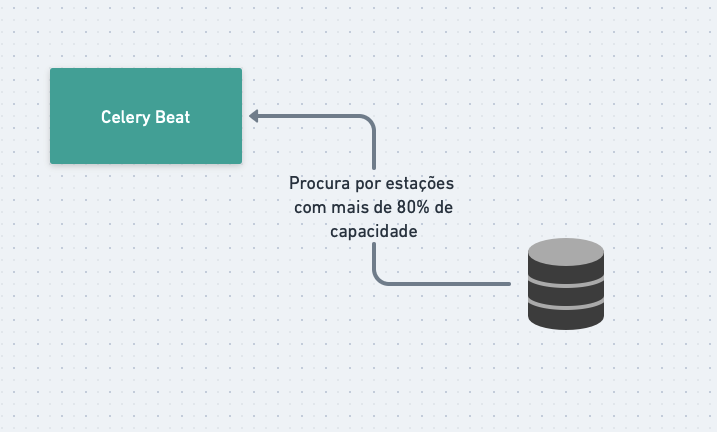

<h1 align="center">Garbage Status</h1>

 Sistema com ReactJS e DjangoRF para mostrar status de estações de coleta de lixo.

## Tecnologias :rocket: 
- ReactJS
- Django REST Framework
- Docker
- Docker Compose

## Arquitetura :triangular_ruler:
No Backend foi utilizado Clean Architecture para dividir as resposabilidades das classes. O Django REST Framework foi utilizado para criar uma API RESTful e essa é a camada mais externa da aplicação (pasta app), aquela que conhece todas as outras camadas internas, assim essa chama classes no domínio, (pasta domain/use_cases) onde as regras do negócio ficam armazenadas. Existe também princípios de injeção de dependência para que as classes não fiquem acopladas e possam ser testadas de forma isolada e trocadas caso necessário, essas estão descritas na pasta repositories.

    <kbd>
        
    </kbd>

Além disso, foi utilizado o Docker para criar containers para cada serviço, assim o desenvolvedor não precisa se preocupar com a instalação de dependências e configurações do ambiente.

Foi utilizado o Celery Beat com o RabbitMQ para ativamente (a cada 5 minutos) verificar o status das estações de coleta de lixo e atualizar o banco de dados caso exista necessidade de criar um alerta de estação de coleta com mais de 80% de sua capacidade.

    <kbd>
        
    </kbd>

## Como rodar :computer:
Para rodar a aplicação é necessário ter o Docker e o Docker Compose instalados na máquina.
